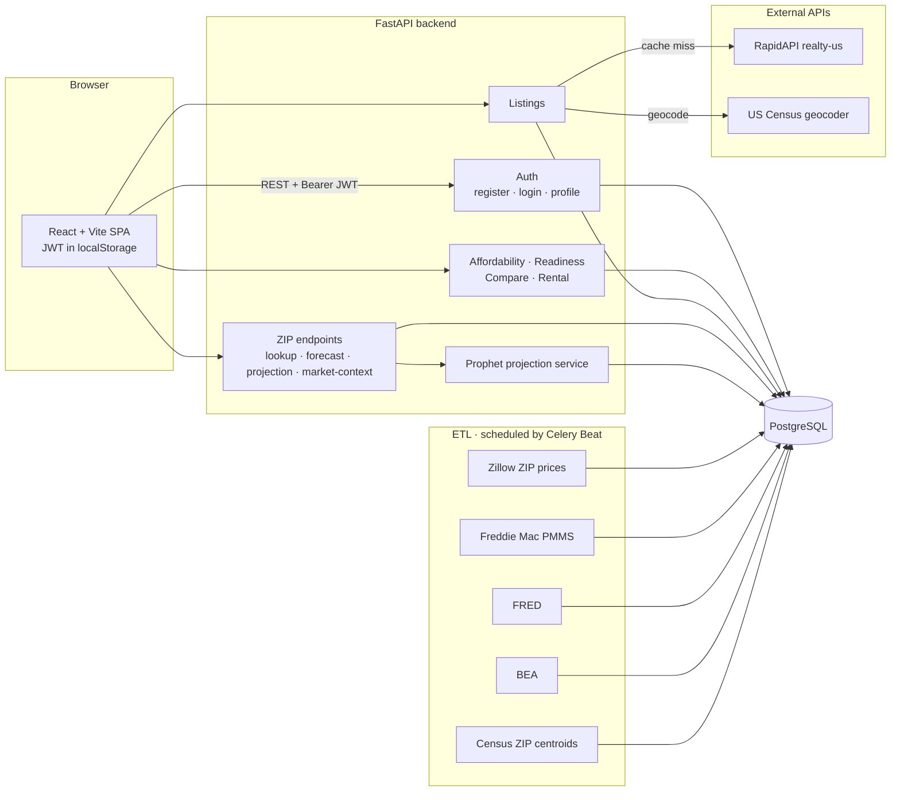

# Touse

A USA housing tool that shows you **what you can afford, where you can afford it, and where prices are heading** — built on live market data, not a bank's optimistic ceiling.

---

## What it does

- **Affordability engine** — your real max home price across 6 loan types (conventional, FHA, VA, USDA, ARM 5/1, jumbo), using the **live 30-year mortgage rate** from Freddie Mac's weekly survey.
- **Scenarios** — save, edit, and compare multiple buy/rent situations ("buy now", "save 12 more months", "with a partner").
- **Readiness score** — a 0–100 score with a concrete action plan. Buy scenarios are scored on 5 forward-looking dimensions (DTI *including the projected mortgage*, down payment, credit, cushion, market fit); rent scenarios use a 4-dimension model (DTI, rent burden, credit, cushion).
- **Interactive map** — real listings filtered to your budget, geocoded to their true locations, centered on your target area.
- **ZIP price forecast** — a 12-month Prophet projection with an 80% confidence band, trained on-demand per ZIP from 6.3M rows of Zillow price history.
- **Market context** — live mortgage rate, CPI inflation, US unemployment, and your state's GDP growth.
- **Now-vs-wait** — models how 12 more months of saving (across three rate scenarios) changes your budget.
- **Public calculator** — an anonymous affordability calculator at `/calculator`, no signup required.

---

## Architecture



**How the data flows**

- **ETL scripts** run offline and populate PostgreSQL. They are the only writers of market data.
- The **FastAPI backend** is read-mostly: it serves computed results (affordability, readiness, forecasts) and proxies live listings.
- **Forecasts** are trained on demand — the first request for a ZIP fits a Prophet model (~1–2s, off the event loop) and caches it in `zip_forecast_results`; later requests are instant.
- **Listings** are fetched from RapidAPI on a cache miss, geocoded to real coordinates via the US Census geocoder, and cached for 6 hours.
- Every user-data endpoint requires a **JWT** and verifies ownership — a user can only read/write their own profile and scenarios.

### Key database tables

| Table | Holds |
|-------|-------|
| `users`, `scenarios` | Accounts and saved buy/rent scenarios |
| `zip_price_history` | ~6.3M monthly Zillow home values by ZIP |
| `zip_centroids` | ~41k ZIP → lat/lng/city/state |
| `zip_forecast_results` | Cached Prophet 12-month projections |
| `macro_indicators` | Mortgage rates, CPI, fed funds, housing starts, unemployment, state GDP |
| `listings_cache` | Geocoded listing snapshots (6h TTL) |

---

## Stack

| Layer | Tech |
|-------|------|
| Frontend | React 18 + Vite + TypeScript |
| Routing / data | React Router v6 · TanStack Query v5 |
| Charts / map | Recharts · MapLibre GL + react-map-gl (OpenFreeMap tiles — no API key) |
| Backend | FastAPI + Python 3.11 · SQLAlchemy (async) |
| Auth | JWT (python-jose) + bcrypt |
| Database | PostgreSQL |
| Forecasting | Prophet (per-ZIP, trained on demand) |
| Deployment | Docker Compose |

---

## Data sources

| Source | Used for | API key |
|--------|----------|---------|
| [Zillow Research](https://www.zillow.com/research/data/) | Monthly home values by ZIP | none (CSV) |
| [Freddie Mac PMMS](https://www.freddiemac.com/pmms) | Weekly 30/15-yr mortgage rates | **none** |
| [FRED](https://fred.stlouisfed.org/) | CPI, fed funds, housing starts, unemployment | `FRED_API_KEY` |
| [BEA](https://apps.bea.gov/API/) | State GDP growth | `BEA_API_KEY` |
| [US Census Geocoder](https://geocoding.geo.census.gov/) | Real listing coordinates | **none** |
| [RapidAPI realty-us](https://rapidapi.com/) | Live for-sale listings | `RAPIDAPI_KEY` |

`BLS_API_KEY` / `CENSUS_API_KEY` are present in config for future use; metro-level forecasting from the original design was retired in favour of the ZIP-native pipeline.

---

## Routes

| Path | Page |
|------|------|
| `/` | Marketing landing |
| `/calculator` | Public affordability calculator (no signup) |
| `/onboarding` | Two-step signup + financial profile |
| `/login` | Sign in |
| `/dashboard` | Affordability snapshot, readiness score, scenarios |
| `/map` | Interactive listings map |
| `/forecast/:zip` | ZIP price forecast + market context |
| `/scenarios/:id` | Scenario detail |
| `/about` | Methodology and data sources |

---

## Getting started (local dev)

**Prerequisites:** Python 3.11, Node 18+, PostgreSQL, a C++ toolchain (for Prophet/Stan).

```bash
# 1. Config — fill in API keys (FRED, BEA, RapidAPI at minimum)
cp .env.example .env

# 2. Database — start PostgreSQL (the default DATABASE_URL expects localhost:5433)
docker compose up -d postgres redis

# 3. Backend
cd backend
python3 -m venv .venv
.venv/bin/pip install -r requirements.txt
.venv/bin/python scripts/setup_prophet.py          # REQUIRED — fixes Prophet's broken bundled Stan
.venv/bin/uvicorn app.main:app --reload --port 8000

# 4. Load data (one-time, from backend/)
.venv/bin/python -m etl.zip_centroids       # ZIP → lat/lng
.venv/bin/python -m etl.zillow_zip          # ZIP price history
.venv/bin/python -m etl.freddie_mac         # mortgage rates
.venv/bin/python -m etl.fred                # CPI, fed funds, unemployment, housing starts
.venv/bin/python -m etl.bea                 # state GDP
.venv/bin/python -m etl.geocode_listings    # backfill real listing coordinates (optional)

# 5. Frontend
cd ../frontend
npm install
npm run dev
```

- Frontend (dev): http://localhost:5173
- API + interactive docs: http://localhost:8000/docs

> **Prophet note:** Prophet 1.1.x ships a broken bundled Stan backend. `scripts/setup_prophet.py` installs a real cmdstan and disables the broken one. It is idempotent — **re-run it after any `pip install` that reinstalls Prophet.**

The whole stack also runs via `docker compose up --build`.

---

## Project structure

```
Touse/
├── frontend/
│   └── src/
│       ├── pages/         # Landing, Dashboard, MapView, Forecast, ScenarioDetail, ...
│       ├── components/    # TouseMap, ScenarioForm, ForecastChart, ZipForecastPanel, ...
│       ├── hooks/         # TanStack Query hooks
│       ├── context/       # AuthContext
│       └── utils/         # api.ts (axios + JWT interceptors)
├── backend/
│   ├── app/
│   │   ├── api/           # Route handlers
│   │   ├── models/        # SQLAlchemy ORM models
│   │   ├── services/      # Affordability, readiness, listings, zip_projection, geocoding
│   │   ├── security.py    # JWT minting + auth dependency
│   │   └── main.py
│   ├── etl/               # Data ingestion scripts
│   ├── scripts/           # setup_prophet.py
│   └── alembic/           # Migrations
├── docker-compose.yml
└── .env.example
```

---

## Notes & limitations

- **Forecasts** are 12-month Prophet projections from price history alone — honest confidence ranges, not guarantees. They extrapolate trend and seasonality; they do not model rate shocks or policy changes.
- **Listing coordinates** come from the US Census geocoder. Addresses it can't match (≈25%) fall back to the ZIP centroid.
- **Market data freshness** is kept current by a Celery Beat schedule (`backend/tasks/celery_app.py`): Freddie Mac mortgage rates weekly, FRED monthly, Zillow ZIP values + forecast retraining monthly, BEA quarterly. The `celery` and `celery-beat` services are included in `docker compose`; the worker image installs cmdstan at build time so forecast retraining works in-container.
