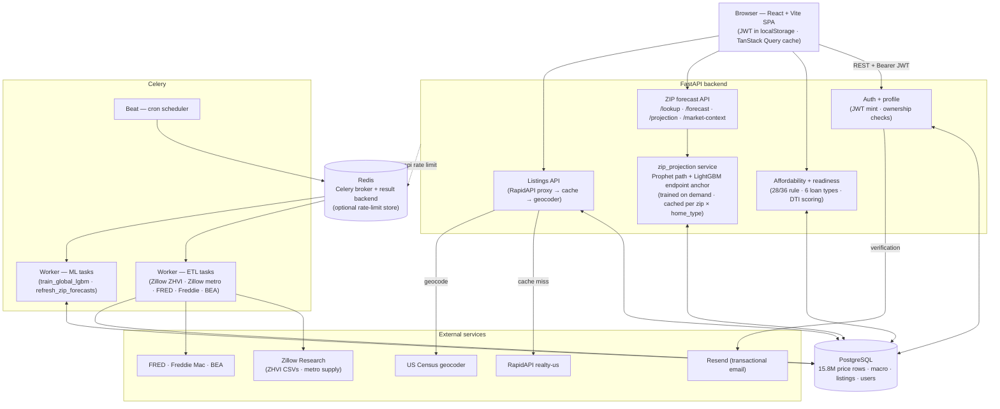

# Touse

A USA housing tool that shows you **what you can afford, where you can afford it, and where prices are heading** — built on live market data, not a bank's optimistic ceiling.

---

## What it does

- **Affordability engine** — your real max home price across 6 loan types (conventional, FHA, VA, USDA, ARM 5/1, jumbo), using the **live 30-year mortgage rate** from Freddie Mac's weekly survey.
- **Scenarios** — save, edit, and compare multiple buy/rent situations; star one as your **primary scenario**, which drives the dashboard headline, the map, and the forecast.
- **Readiness score** — a 0–100 score with a concrete action plan. Buy scenarios are scored on 5 forward-looking dimensions (DTI *including the projected mortgage*, down payment, credit, cushion, market fit); rent scenarios use a 4-dimension model (DTI, rent burden, credit, cushion).
- **Interactive map** — real listings filtered to your budget, geocoded to their true locations, centered on your primary scenario's area; click a listing card to fly to it. Filter by property type, beds/baths, square footage, year built, and lot size.
- **ZIP price forecast** — a 12-month projection with an 80% confidence band: a global **LightGBM panel model** (lagged prices + US macro + metro supply/rent + election cycle) sets the endpoint, and a per-ZIP **Prophet** model shapes the path. **Type-aware** — switch between all-homes, single-family, and condo forecasts. **Rate-scenario overlays** (rates ±1 point) stress-test sensitivity.
- **Market context** — live mortgage rate, CPI inflation, US unemployment, and your state's GDP growth.
- **Now-vs-wait** — models how *X* more months of saving (across three rate scenarios) changes your budget.
- **Accounts** — email-or-username login, a profile page to manage details and password, and email verification (via Resend).
- **Public calculator** — try affordability anonymously right on the landing page, no signup required.

---

## Architecture

Touse is a small monolith split into four cooperating processes — a Vite SPA, a FastAPI backend, a Celery worker, and a Celery Beat scheduler — backed by PostgreSQL and Redis. Market data is collected by Celery on a public-source cadence, written to Postgres, and served read-mostly by FastAPI. The forecast pipeline is two-stage: a global LightGBM panel sets each ZIP × home-type's 12-month endpoint offline, and a per-`(zip, home_type)` Prophet model shapes the monthly path on demand.



### Request lifecycle — the headline path

A logged-in user opening their dashboard fans out into three independent reads, all carrying the JWT:

1. **`GET /scenarios/user/{id}`** → `scenarios` table → the SPA renders the primary scenario card.
2. **`POST /readiness`** with the primary scenario → `readiness_service` blends affordability math + DTI + market fit → 0–100 score and action plan.
3. **`GET /api/v1/zip/projection?zip=...&home_type=...`** → `zip_projection.get_or_train()`:
   - Hits `zip_forecast_results` for a cached projection. If found, returned immediately.
   - On miss, pulls all monthly history for `(zip, home_type)` from `zip_price_history`, looks up the LightGBM 12-month endpoint anchor in `zip_lgbm_predictions`, fits Prophet (~1–2 s) anchored to that endpoint, caches the result, returns it.

TanStack Query keeps everything cached client-side; revisits are instant.

### Forecast pipeline (two-stage, offline + on-demand)

```
                 ┌─────────────────── offline (monthly, Celery) ──────────────────┐
                 │                                                                │
ZHVI CSVs ─┐     │   build_panel()                                                │
metro CSVs ┼──→ Postgres ──→  zip × home_type × month                             │
FRED feed ─┘                  + lagged prices + growth rates                      │
                              + US macro + metro supply + rent + election cycle   │
                              → LightGBM panel (n_estimators=250, subsample=0.7,  │
                                 zip_code + home_type as categoricals)            │
                                            ↓                                     │
                              zip_lgbm_predictions ← endpoint anchor per (z, ht)  │
                 │                                                                │
                 └────────────────────────────────────────────────────────────────┘
                                            ↓
                            on demand (first request per z × ht)
                                            ↓
                  Prophet(yearly_seasonality=True) on (z, ht) history
                              ↓
                  blend toward LightGBM endpoint + long-run CAGR
                              ↓
                  zip_forecast_results ←  12 monthly points + 80% band
```

Cached forecasts live in Postgres so a restart loses nothing. Celery refreshes the cache the day after the LightGBM panel retrains, so served forecasts always reflect the newest macro snapshot.

### Refresh cadence (Celery Beat)

All times UTC. Cadence matches each source's actual publication schedule (see `backend/tasks/celery_app.py`).

| When | Task | Why |
|------|------|-----|
| Friday 09:00 | `run_freddie_mac_etl` | PMMS publishes every Thursday |
| Monday 02:00 | `run_fred_etl` | Weekly pass picks up monthly + back-revisions |
| 15th 03:00 | `run_zillow_zip_etl` | Zillow ZHVI publishes mid-month (3 home types) |
| 15th 03:30 | `run_zillow_metro_etl` | Metro supply panel publishes alongside |
| Quarterly | `run_bea_etl` | State GDP is annual; quarterly pass is plenty |
| 16th 02:00 | `train_global_lgbm` | Day after fresh Zillow data — retrain the panel |
| 16th 04:00 | `refresh_zip_forecasts` | Re-fit Prophet caches against new anchors |

### Trust boundaries

- **ETL workers are the only writers of market data.** API routes never write `zip_price_history`, `macro_indicators`, etc. — this keeps the read path simple and prevents user input from corrupting market state.
- **Every user-data endpoint requires a JWT and verifies ownership.** A user can only read/write their own profile and scenarios; the `public_id` on scenarios is a non-enumerable opaque token so shared/scenario URLs can't be guessed.
- **Listings flow is RapidAPI → Census geocoder → 6-hour cache.** Addresses the geocoder can't match (≈25%) fall back to the ZIP centroid; the rest land on real coordinates.
- **Rate limiting is per-IP via slowapi** — in-memory by default, switchable to Redis via `RATELIMIT_STORAGE_URI` so the limit holds across multiple backend instances behind a load balancer.

### Key database tables

| Table | Holds |
|-------|-------|
| `users`, `scenarios` | Accounts and saved buy/rent scenarios (scenarios keyed by a non-enumerable `public_id`; each scenario carries a `home_type`) |
| `zip_price_history` | ~15.8M monthly Zillow ZHVI values by (ZIP, `home_type`: all / single_family / condo) |
| `zip_centroids` | ~41k ZIP → lat/lng/city/state |
| `zip_forecast_results` | Cached 12-month projections, keyed by (zip, home_type) |
| `zip_lgbm_predictions` | Endpoint anchors from the global LightGBM panel, per (zip, home_type) |
| `macro_indicators` | Mortgage rates, CPI, fed funds, housing starts, unemployment, consumer sentiment, new-home sales, state GDP |
| `metro_supply_history` | Zillow Research metro supply + rent panel (inventory, new listings, days-on-market, price cuts, median rent) |
| `listings_cache` | Geocoded listing snapshots (6h TTL) with property type, sqft, year built, lot size |
| `contact_messages` | Submissions from the contact form |

---

## Stack

| Layer | Tech |
|-------|------|
| Frontend | React 18 + Vite + TypeScript |
| Routing / data | React Router v6 · TanStack Query v5 |
| Charts / map | Recharts · MapLibre GL + react-map-gl (OpenFreeMap tiles — no API key) |
| Backend | FastAPI + Python 3.11 · SQLAlchemy (async) |
| Auth | JWT (python-jose) + bcrypt |
| Database | PostgreSQL · Alembic migrations |
| Forecasting | LightGBM panel (global, retrained monthly) + Prophet (per-ZIP × home_type, trained on demand) |
| Background jobs | Celery + Redis (Beat schedule for ETL & retraining) |
| Email | Resend (transactional) |
| Deployment | Docker Compose |

---

## Data sources

| Source | Used for | API key |
|--------|----------|---------|
| [Zillow Research](https://www.zillow.com/research/data/) | Monthly ZHVI by ZIP × home type (all / SFR / condo); metro supply + rent panel | none (CSV) |
| [Freddie Mac PMMS](https://www.freddiemac.com/pmms) | Weekly 30/15-yr mortgage rates | **none** |
| [FRED](https://fred.stlouisfed.org/) | CPI, fed funds, housing starts, unemployment, UMich consumer sentiment, new-home sales | `FRED_API_KEY` |
| [BEA](https://apps.bea.gov/API/) | State GDP growth | `BEA_API_KEY` |
| [US Census Geocoder](https://geocoding.geo.census.gov/) | Real listing coordinates | **none** |
| [RapidAPI realty-us](https://rapidapi.com/) | Live for-sale listings | `RAPIDAPI_KEY` |
| [Resend](https://resend.com/) | Account verification emails | `RESEND_API_KEY` |

Metro-level forecasting from the original design was retired in favour of the ZIP-native pipeline. Without `RESEND_API_KEY` the app still runs — verification emails are logged instead of sent.

---

## Routes

| Path | Page |
|------|------|
| `/` | Marketing landing + public affordability calculator |
| `/onboarding` | Two-step signup + financial profile |
| `/login` | Sign in (email or username) |
| `/verify-email` | Email-verification landing |
| `/dashboard` | Headline (primary scenario), readiness score, scenarios |
| `/profile` | Manage account details and password |
| `/map` | Interactive listings map |
| `/forecast/:zip` | ZIP price forecast + market context (with `?type=single_family\|condo`) |
| `/scenarios/:publicId` | Scenario detail |
| `/about` | Methodology, data sources, contact form |

---

## Getting started (local dev)

**Prerequisites:** Python 3.11, Node 18+, PostgreSQL, a C++ toolchain (for Prophet/Stan).

```bash
# 1. Config — fill in API keys (FRED, BEA, RapidAPI at minimum)
cp .env.example .env

# 2. Database — start PostgreSQL (the default DATABASE_URL expects localhost:5433)
docker compose up -d postgres redis

# 3. Backend
cd backend
python3 -m venv .venv
.venv/bin/pip install -r requirements.txt
.venv/bin/python scripts/setup_prophet.py          # REQUIRED — fixes Prophet's broken bundled Stan
.venv/bin/uvicorn app.main:app --reload --port 8000

# 4. Load data (one-time, from backend/)
.venv/bin/python -m etl.zip_centroids       # ZIP → lat/lng
.venv/bin/python -m etl.zillow_zip          # ZIP price history (all / single_family / condo)
.venv/bin/python -m etl.zillow_metro        # metro supply + rent panel
.venv/bin/python -m etl.freddie_mac         # mortgage rates
.venv/bin/python -m etl.fred                # CPI, fed funds, unemployment, housing starts, sentiment
.venv/bin/python -m etl.bea                 # state GDP
.venv/bin/python -m etl.geocode_listings    # backfill real listing coordinates (optional)

# 4b. Train the LightGBM endpoint model (one-time; Celery retrains it monthly)
.venv/bin/python -m app.ml.train_lgbm --save-predictions

# 5. Frontend
cd ../frontend
npm install
npm run dev
```

- Frontend (dev): http://localhost:5173
- API + interactive docs: http://localhost:8000/docs

> **Prophet note:** Prophet 1.1.x ships a broken bundled Stan backend. `scripts/setup_prophet.py` installs a real cmdstan and disables the broken one. It is idempotent — **re-run it after any `pip install` that reinstalls Prophet.**

The whole stack also runs via `docker compose up --build`.

---

## Project structure

```
Touse/
├── frontend/
│   └── src/
│       ├── pages/         # Landing, Dashboard, MapView, Forecast, ScenarioDetail, ...
│       ├── components/    # TouseMap, ScenarioForm, ForecastChart, ZipForecastPanel, ...
│       ├── hooks/         # TanStack Query hooks
│       ├── context/       # AuthContext
│       └── utils/         # api.ts (axios + JWT interceptors)
├── backend/
│   ├── app/
│   │   ├── api/           # Route handlers
│   │   ├── models/        # SQLAlchemy ORM models
│   │   ├── services/      # Affordability, readiness, listings, zip_projection, geocoding
│   │   ├── ml/            # train_lgbm.py — global panel model + backtest
│   │   ├── security.py    # JWT minting + auth dependency
│   │   └── main.py
│   ├── etl/               # Data ingestion scripts (Zillow ZIP × type, metro supply, FRED, BEA, ...)
│   ├── scripts/           # setup_prophet.py
│   └── alembic/           # Migrations
├── docker-compose.yml
└── .env.example
```

---

## Notes & limitations

- **Forecasts** are 12-month projections: a global LightGBM panel (lagged prices + US macro + metro supply/rent + election cycle) sets the endpoint, and a per-ZIP × home-type Prophet model shapes the monthly path. Honest confidence ranges, not guarantees. The model can't anticipate rate surprises or policy shocks, so the forecast page offers illustrative rate-scenario overlays.
- **Type-aware:** condo and single-family forecasts are served for ZIPs where Zillow publishes a separate series; otherwise the all-homes index is used.
- **Listing coordinates** come from the US Census geocoder. Addresses it can't match (≈25%) fall back to the ZIP centroid.
- **Market data freshness** is kept current by a Celery Beat schedule (`backend/tasks/celery_app.py`): Freddie Mac mortgage rates weekly, FRED monthly, Zillow ZIP values + metro supply + LightGBM panel retraining monthly, BEA quarterly. The `celery` and `celery-beat` services are included in `docker compose`; the worker image installs cmdstan at build time so Prophet retraining works in-container.
